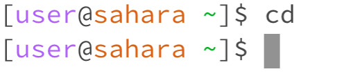
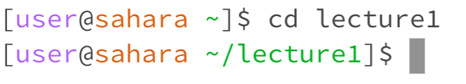
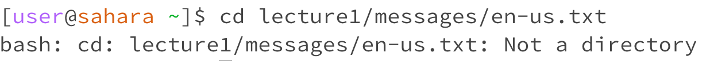
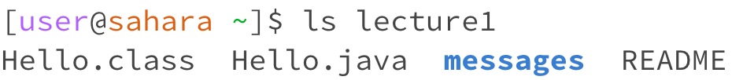
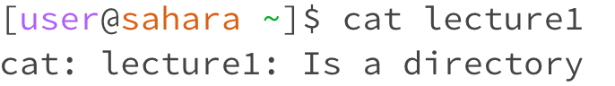
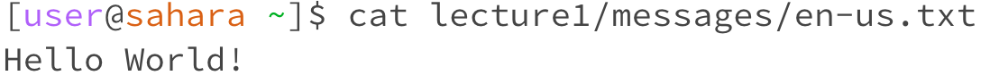

# Lab Report 1 - Salman Navroz
## cd examples
1. No arguments 
* The working directory when the command was run was the home directory.
* There was no output because there was no argument/directory given for the cd command to move into. Therefore, the command did not do anything and stayed in the home directory. Based on other tests the cd command with no arguments makes the working directory the home directory.
* The output was not an error because it did not have any directory to go into, so it just stayed in the home directory.
2. Directory as an argument 
* The working directory when the command was run was the home directory.
* The cd command with a directory as an argument switched the working directory to that directory which in this case was the lecture1 directory. The cd command changes the working directory to the argument given if it is a valid directory which is why it changed to lecture 1 as seen in the second line of the screenshot.
* The output is not an error because lecture1 is a valid directory in the workspace.
3. File as an argument 
* The working directory when the command was run was the home directory.
* The output was the terminal printing that the file en-us.txt from the path lecture1/messages/en-us.txt is not a directory. This is the output because cd needs a valid directory to work because it needs to make the working directory the new directory given as an argument, but it cannot do so with a file (in this case a txt file).
* The output is expected, but technically an error because cd did not work. It did not work because en-us.txt is a file and cd needs a directory (not a file) to work.
  
## ls examples
1. No arguments 
* The working directory when the command was run was the home directory.
* The output was the terminal printing the lecture1 directory name on the next line. This is the output because ls lists all of the directories and files in the working directory if no arguments are given, so it printed the lecture1 directory because that is the only file or directory in the home directory (in this workspace).
* The output is not an error because lecture1 is the only thing (directory or file) in the home directory.
2. Directory as an argument 
* The working directory when the command was run was the home directory.
* The output was the terminal printing the files and directories that the lecture1 folder contains. This is the output because ls lists the files and directories of the given argument if it is a valid directory.
* The output is not an error because a valid directory was given and it listed all the appropriate files and folders in the directory.
3. File as an argument 
* The working directory when the command was run was the home directory.
* The output was the terminal printing the path of the file that was given as an argument (lecture1/Hello.java). This was the output because Hello.java is not a directory, so ls just printed the file path as a file cannot contain other files or directories unlike a directory.
* This output is not technically an error because it just prints the path and does not crash the terminal session, although ls was not given a directory as it is intended to recieve. 
## cat examples
1. No arguments 
* The working directory when the command was run was the home directory.
* There was no output as it went to the next line and got stuck with nothing printed. This happened because cat can only work with a file argument because it needs something to print to the terminal.
* The output is an error because a valid file was not given, so cat could not print out any file.
2. Directory as an argument 
* The working directory when the command was run was the home directory.
* The output was a messaage saying that lecture1 is a directory. Essentially it is saying that cat needs a file and cannot do anything with a directory as an argument.
* The output is an error message because cat cannot print a directory and needs a file as an argument to work.
3. File as an argument 
* The working directory when the command was run was the home directory.
* The output was the terminal printing the contents of the en-us.txt file which was "Hello World!". This is the output because cat prints out the contents of a file including the code from something like a java file.
* This output is not an error because a valid file path was given, so it could print it out.
