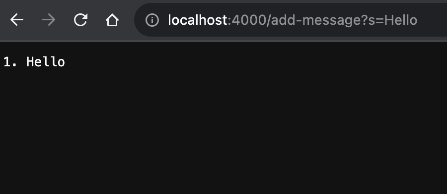
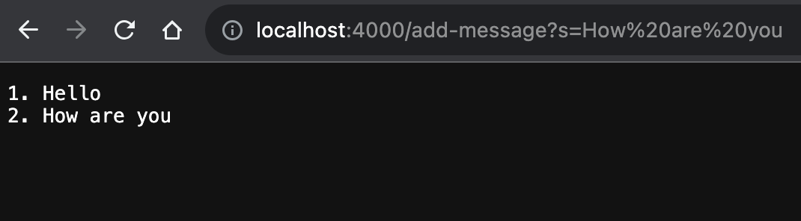
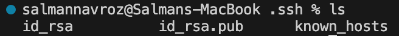
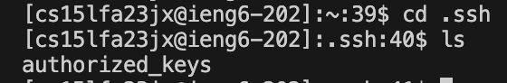
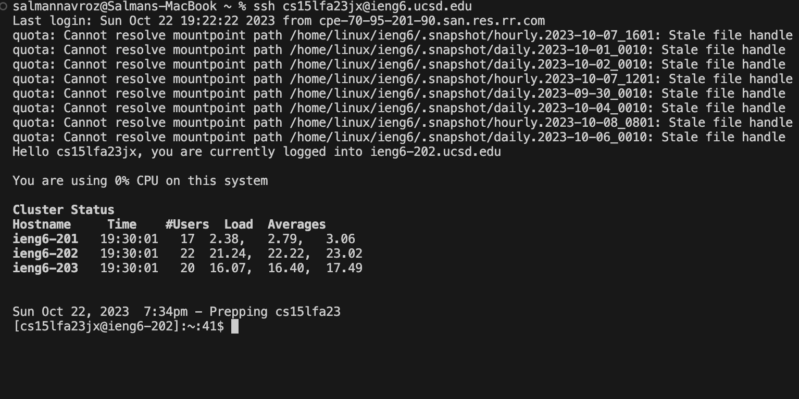

# Lab Report 1 - Salman Navroz
## Part 1
## StringServer.java
```
import java.io.IOException;
import java.net.URI;

class Handler implements URLHandler {
    int stringNum = 0;
    String str = "";

    public String handleRequest(URI url) {
        if(url.getPath().contains("/add-message")) {
            String[] params = url.getQuery().split("=");
            if(params[0].equals("s")) {
                stringNum++;
                str += stringNum + ". " + params[1] + "\n";
                return String.format(str);
            }
        } 
         return "Error: Enter Valid Query";
    }
}
public class StringServer {
     public static void main(String[] args) throws IOException {
        if(args.length == 0){
            System.out.println("Missing port number! Try any number between 1024 to 49151");
            return;
        }

        int port = Integer.parseInt(args[0]);

        Server.start(port, new Handler());
    }
    
}

```

## Query Examples
_1. http://localhost:4000/add-message?s=Hello _
* The methods called in this code are the start() method which is part of the Server class and starts the server, the handleRequest(URI url) method which is part of the Handler class, and methods part of the URI class such as getQuery() and getPath().
* The arguments the start method takes in is the port number and a Handler object because it uses these to handle incoming url requests and queries. The handler object is important because it contains the stringNum int variable and the str String variable which tracks and stores the values of the string that is outputted to the ui. The handleRequest method, inside the Handler class, takes in a URI object which is the url that is passed in when a url request is sent on the specific server port.
* From this specific request the stringInt int variable in the Handler class gets incremented by 1 (to 1 from zero) because the handleRequest method recieves the url and the first if statement is true because the url contained the path /add-message and then the nested if statement is also true because the first thing after the path and before the "=" was an "s" (param[0]). The param array of Strings was created by using the split variable and passing in the "=" so it could split up the string "s=How are you" into ["s", Hello"]. The string for the new line is added to the str String variable and it contains the newly incremented stringNum variable, the string in the query (param[0]), which is Hello in this case, and a new line, so the request changes the stringNum variable from an empty string ("") to "1. Hello\n".
_2. http://localhost:4000/add-message?s=How are you _
* The methods called in the code is the start() method which is part of the Server class and starts the server, the handleRequest(URI url) method which is part of the Handler class, and methods part of the URI class such as getQuery() and getPath().
* The arguments the start method takes in is the port number and a Handler object because it uses these to handle incoming url requests and queries. The handler object is important because it contains the stringNum int variable and the str String variable which tracks and stores the values of the string that is outputted to the ui. The handleRequest method, inside the Handler class, takes in a URI object which is the url that is passed in when a url request is sent on the specific server port.
* From this specific request the stringInt int variable in the Handler class gets incremented by 1 and since it was already 1 from the first request and becomes 2 now. This is because the handleRequest method recieves the url and the first if statement is true because the url contained the path /add-message and then the nested if statement is also true because the first thing after the path and before the "=" was an "s" (param[0]). The param array of Strings was created by using the split variable and passing in the "=" so it could split up the string "s=How are you" into ["s", How are you"]. The string for the new line is added to the str String variable and it contains the newly incremented stringNum variable, the string in the query (param[0]), which is How are you in this case, and a new line, so the request changes the stringNum variable from an empty string ("") to "2. How are you\n".

## Part 2
* _Path to private ssh key_ 
* _Path to private ssh key_ 
* _Succesful login w/o password_ 

## Part 3
Something new I learned in lab the last couple weeks is that you are able to remotely access and control another computer using the ssh command. With this command I learned you can login to a computer remotely and use the normal terminal commands to modify and access files and directories. Also, I learned that you can securely transfer files to remote computers using the scp command, a file argument and the path from the remote computer of the transfer location.
