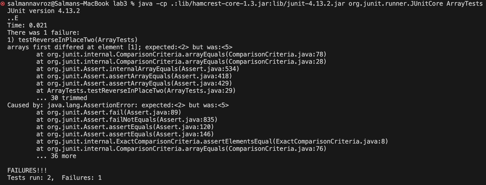
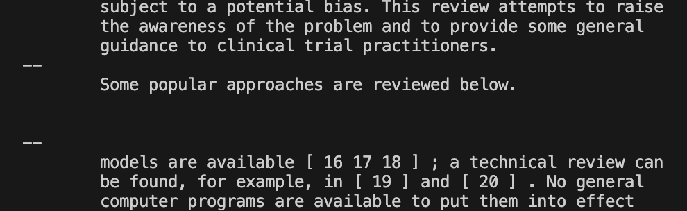
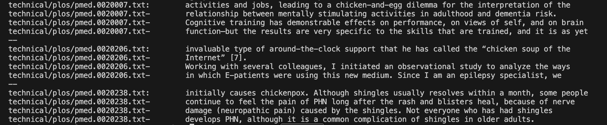

# Lab Report 3

## Part 1 - Bugs
* Failure Inducing Input:
```
  @Test
  public void testReverseInPlaceTwo() {
    int[] input1 = {2, 5};
    ArrayExamples.reverseInPlace(input1);
    assertArrayEquals(new int[]{ 5, 2 }, input1);
  }
```
The failure inducing input here is the array [2,5].

* Input that does not induce failure:
```
	@Test 
	public void testReverseInPlace() {
    int[] input1 = { 7 };
    ArrayExamples.reverseInPlace(input1);
    assertArrayEquals(new int[]{ 7 }, input1);
	}
```
The input here that does not induce failure is the array [7].

* Symptom:


* Bug Fix

Before:
```
  static void reverseInPlace(int[] arr) {
    for(int i = 0; i < arr.length; i += 1) {
      arr[i] = arr[arr.length - i - 1];
    }
  }
```

After:
```
  static void reverseInPlace(int[] arr) {
    int[] tempArr = Arrays.copyOf(arr, arr.length);
    for(int i = 0; i < arr.length; i += 1) {
      arr[i] = tempArr[arr.length - i - 1];
    }
  }
```

* Explanation: In order to fix this bug I needed to make a copy of the original array that holds the same values as that array because before, the array was setting the reversed values from the values of itself, so the values would be changed by the time the index got there.

## Part 2 - Researching Commands

### We will be focusing on the options for the **grep** command.

* `-n` option
	* `grep -n "trials" technical/biomed/1468-6708-3-3.txt`

   Output:
```
11:        disease. These trials found that when compared with
19:        these trials did not assess the effect of lipid-lowering
89:        prevention trials, the benefit of statin therapy was not
95:        prevention statin trials had excluded patients with
149:        Nevertheless, a number of trials have established the
153:        recent trials have suggested that higher risk patients with
259:        and the A-2-Z trials, this study will not assess the
268:        trials will be carried out in this area. Future secondary
```

    The -n option for the grep command prints out all of the lines of the given file with the given string argument, "trials" in this case, and includes the line number for each line. This is useful if you want to see the line number and contents of the line at the same time.
	* `grep -n "Arizona" technical/911report/*.txt`
      
      Output:

The -n option prints out all of the lines with the given string in each txt file in the 911report directory with the corresponding line number before each line. In this case it's useful if you want to see every line and line number in a directory that contains the specific string. 

* `-l` option
	* `grep -l "chicken" technical/biomed/1468-6708-3-3.txt`

    	Output: `NONE`


   The -l option prints out which files of the given files contains the string or pattern given which is "chicken" in this case and there is only file given as an argument in this case. The file given does not contain the "chicken" string, so no files are printed.


	* `grep -l "happy" technical/plos/*.txt`
	

  	Output:

  
```
technical/plos/journal.pbio.0020053.txt
technical/plos/journal.pbio.0020140.txt
technical/plos/journal.pbio.0020164.txt
technical/plos/journal.pbio.0020262.txt
technical/plos/journal.pbio.0030065.txt
technical/plos/journal.pbio.0030129.txt
technical/plos/pmed.0010052.txt
technical/plos/pmed.0020118.txt
technical/plos/pmed.0020158.txt
technical/plos/pmed.0020203.txt
technical/plos/pmed.0020209.txt
```


  The -l option looks through the given text files and if it contains the string argument that was given in the command, it prints out the text 
 file. In this case it takes in all of the txt files of the plos directory as an argument and prints out all of the files that contain the string "happy" in the directory.

* `-o` option
	* `grep -o "dementia" technical/plos/pmed.0020275.txt`


	Output:


   ```
dementia
dementia
dementia
dementia
dementia
dementia
dementia
dementia
dementia
dementia
dementia
dementia
dementia
```


    The -o option prints out the first instance of the given string in each line in the given file. This file in particular had 13 lines that contained the string "dementia", so dementia was printed 13 times. This is useful if you don't need to store the entire line and just want to use grep to count the number of line that contains the string, saving storage in the process.
	* `grep -o "restricted" technical/plos/pmed*.txt`


      Output:


      ```
technical/plos/pmed.0010008.txt:restricted
technical/plos/pmed.0010023.txt:restricted
technical/plos/pmed.0010028.txt:restricted
technical/plos/pmed.0010050.txt:restricted
technical/plos/pmed.0010052.txt:restricted
technical/plos/pmed.0010060.txt:restricted
technical/plos/pmed.0020015.txt:restricted
technical/plos/pmed.0020015.txt:restricted
technical/plos/pmed.0020102.txt:restricted
technical/plos/pmed.0020103.txt:restricted
technical/plos/pmed.0020103.txt:restricted
technical/plos/pmed.0020209.txt:restricted
technical/plos/pmed.0020216.txt:restricted
technical/plos/pmed.0020231.txt:restricted
technical/plos/pmed.0020231.txt:restricted
technical/plos/pmed.0020231.txt:restricted
technical/plos/pmed.0020231.txt:restricted
technical/plos/pmed.0020231.txt:restricted
technical/plos/pmed.0020231.txt:restricted
technical/plos/pmed.0020231.txt:restricted
technical/plos/pmed.0020231.txt:restricted
technical/plos/pmed.0020231.txt:restricted
technical/plos/pmed.0020231.txt:restricted
technical/plos/pmed.0020275.txt:restricted```


  For each line that contains the string "restricted" in the pmed directory, restricted is printed. This could be useful if you want to see the total number of lines in a directory that contains a particular string.

* `-A[NumberOfLines(n)]` option
	* `grep -A2 "review" technical/biomed/1468-6708-3-4.txt`


	Output:


	


	The -A2 option prints out the particular line or lines 		in the file given that contains the given string. It 		also prints out the 2 lines after the lines that 		contains that string. The number of lines printed after 	the line with the string printed is decided by the 		number after -A which is 2 in this example. This is 		useful if you want to see the given string in the 		context of the file.


	* 'grep -A3 "chicken" technical/plos/*.txt`


	Output:


	


	The -A option in this case prints out the line or lines 	in each file in the plos directory that contains the 		string "chicken" with the 3 lines after that particular 	line. The 3 lines is specified by the 3 after the -A in 	the command. This could be useful for find many 		different examples of how a piece of code is used in 		context or how a certain word is used in the context of 	a piece of writing.


## Citation: All of these options were found at [https://www.geeksforgeeks.org/grep-command-in-unixlinux](https://www.geeksforgeeks.org/grep-command-in-unixlinux)
