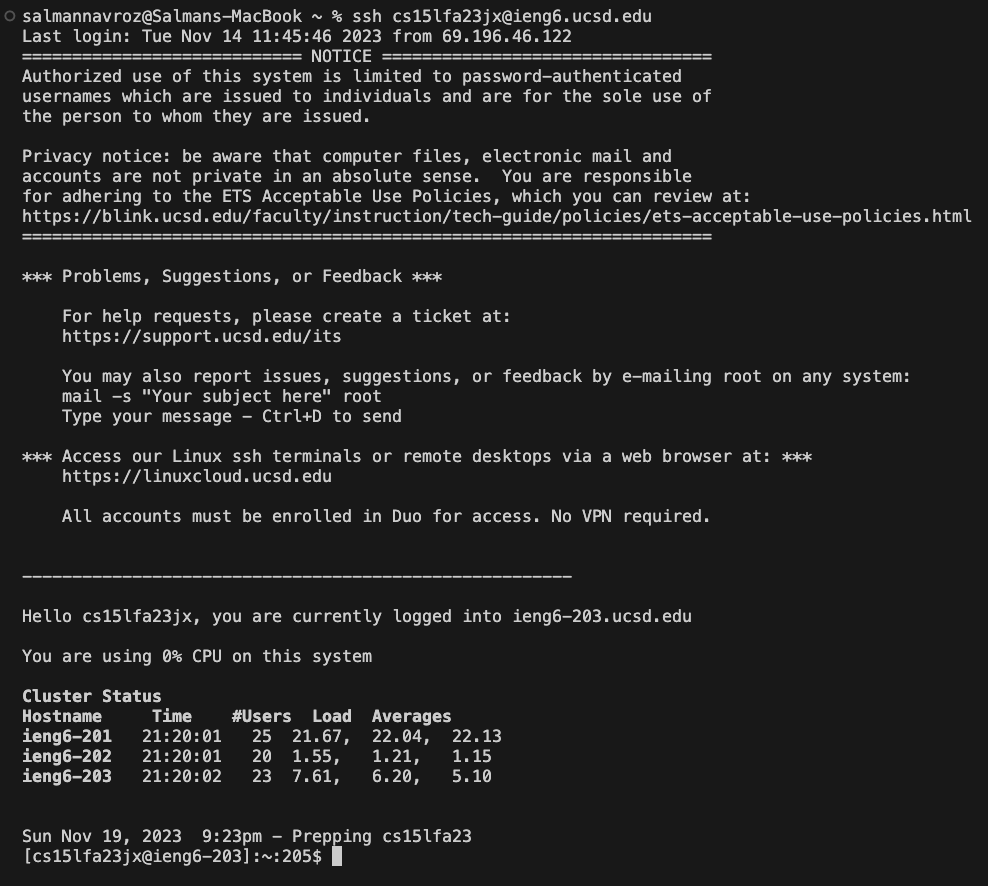
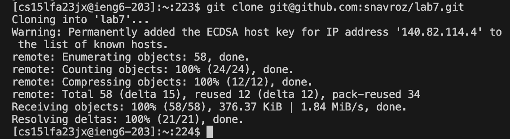
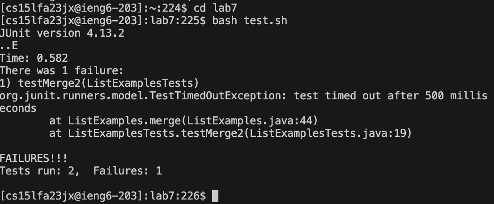
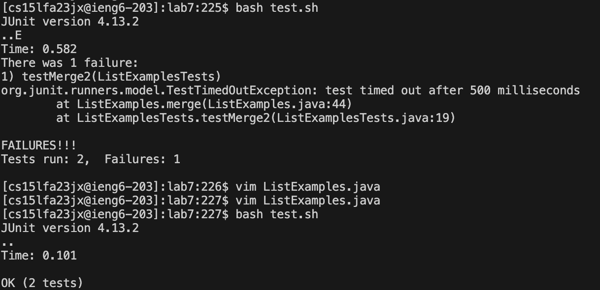
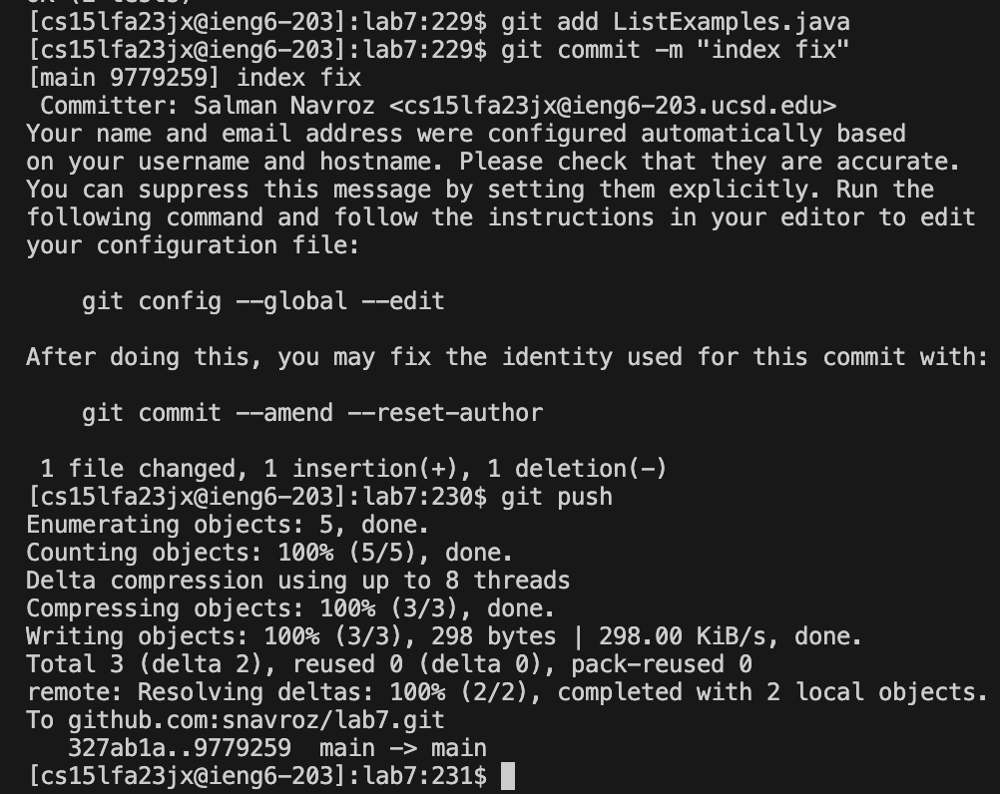

# Lab Report 4 - Salman Navroz 
4. Log into ieng6
- Keys pressed: `<up><enter>` The `ssh cs15lfa23jx@ieng6.ucsd.edu` command was the last command I ran in my history, so it was up 1 and I pressed enter to run it and to log into ieng6.
- 

5. Clone your fork of the repository from your Github account (using the SSH URL)
- Keys pressed: `<g><i><t><space><c><l><o><n><e><space><cmd><v><enter>` To clone the fork of the repository I type in `git clone` , paste in the ssh url `git@github.com:snavroz/lab7.git` and press enter to run the command and clone the repository.
- 

6. Run the tests, demonstrating that they fail
- Keys pressed: `<c><d><space><l><a><b><7><enter>`, `<b><a><s><h><space><t><e><s><t><.><s><h>` The first command `cd lab7` goes into the lab7 directory which contains the test.sh which runs the tests. To run the tests I run `bash test.sh` and press enter to run the test script and show that the tests failed.
- 

7. Edit the code file to fix the failing test
- Keys pressed: `<v><i><m><space><Shift><l><i><s><t><space><Shift><e><x><a><m>
<l><e><s><.><j><a><v><a>`, `<4><3><j><e><x><i><2><esc><shift><;><w><q><enter>` The first command `vim ListExamples.java` goes into vim for the ListExamples.java file, so we can edit it. In vim to go down 43 lines to the line needing editing I run `43j` which takes the cursor to that line. Next, `e` takes the cursor to the end of the first word on the line which is `index1`. `index1` needs to be changed to `index2`, so `x` deletes the `1` because the cursor is at that positon, then `I` goes into insert mode and typing `2` makes it `index2`. Finally, the escape key takes it out of insert mode and typing `:wq` and pressing enter saves the file and exits vim. 
- 

8. Run the tests, demonstrating that they now succeed
- Keys pressed: `<up><up><enter>` The `bash test.sh` command was 2 up in my command history, so I accessed it by using the up arrow key twice and ran it with enter. After running the command the output showed the tests were successful.
- 

9. Commit and push the resulting change to your Github account.
- Keys pressed: `<g><i><t><space><a><d><d><space><Shift><l><i><s><t><space><Shift><e><x><a><m>
<l><e><s><.><j><a><v><a><enter>` , `<g><i><t><space><c><o><m><m><i><t><space><-><m><space><Shift><'><i><n><d><e><x><space><f><i><x><Shift><'><enter>` , `<g><i><t><space>
<u><s><h><enter>`
- The first command `git add ListExamples.java` makes git include the ListEamples.java file in the next commit. The second command `git commit -m "index fix"` commits the changes, in this case the changes to the ListExamples.java file, with the message "index fix". Lastly, the `git push` command pushes the commit to the main branch in your respository on your github account.
- 
