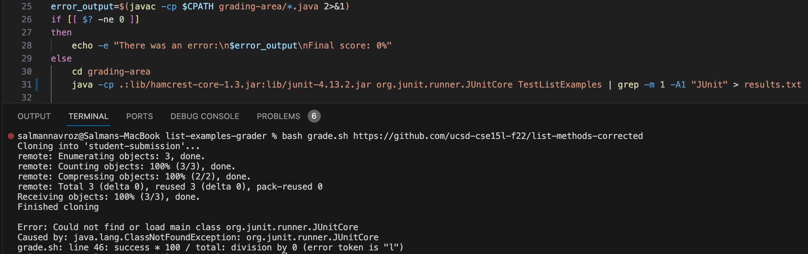
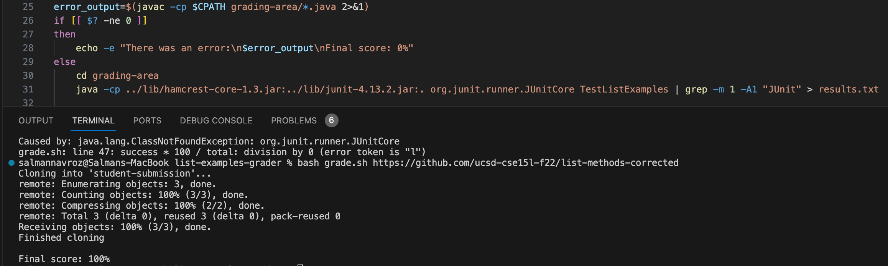
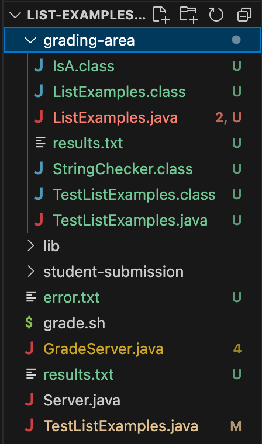
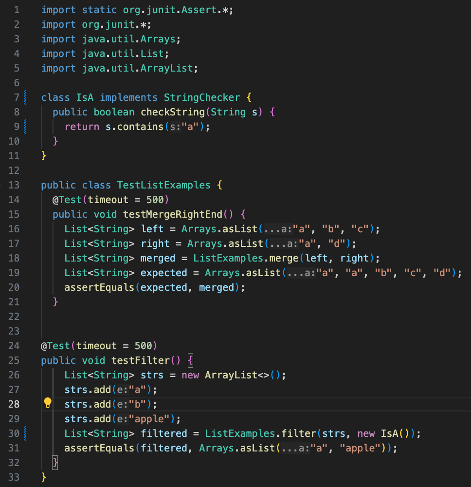
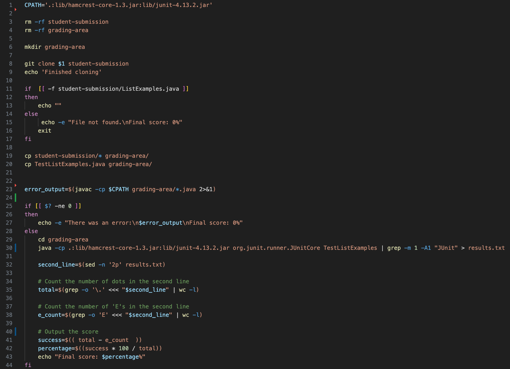

# Lab Report 5 - Salman Navroz 

## Part 1 – Debugging Scenario

### 1. Student Post

Hello, I am struggling with getting the test class to run with JUnit for my grading script. The error is states `Error: Could not find or load main class org.junit.runner.JUnitCore
Caused by: java.lang.ClassNotFoundException: org.junit.runner.JUnitCore`. This is confusing to me because I used the path for lib that we have always used in class to access and run Junit tests and I can see `lib` in my project directory, but it is still giving me this error. Is the problem potenitally because my script runs `cd` into the `grading-area` directory which does not contain the `lib` directory?

### 2. TA Response

Yes, you are correct that the lib directory is not in the grading-area directory which is most likely why you are getting the error that the JUnit class cannot be found. Think about how `..` and `../` can be used to access files from the parent directory of a directory. What is the path of the `lib` directory relative to the `grading-area` directory? Try using the relative path of lib.

### 3. Student Bug Fix Result

The bug is that the path used for the lib directory which is needed to run the JUnit classes which are needed for the TestListExamples class is accessing a lib directory from the current directory. There is no lib directory in the grading-area directory, so this is the wrong path. 

### 4. Setup

- Directory Structure:

- File Contents Before Bug Fix

  `TestListExamples.java`:

  

  `grade.sh`:

  

- The command run inside the grade.sh file that triggered the bug was `java -cp .:lib/hamcrest-core-1.3.jar:lib/junit-4.13.2.jar org.junit.runner.JUnitCore TestListExamples | grep -m 1 -A1 "JUnit" > results.txt`. The command ran to run `grade.sh` with the student's repository url that needed to be graded was `bash grade.sh https://github.com/ucsd-cse15l-f22/list-methods-corrected`.
 
- The actual lib directory is inside the parent directory (the project directory), so we need to put a ../ before the path to go back one directory into the parent directory to access the correct `lib` directory. The correct path is now `../lib/hamcrest-core-1.3.jar:../lib/junit-4.13.2.jar:.` which allows the grading script to succesfully run JUnit and the whole script as a whole becuase it succesfully accesses the hamcrest-core-1.3.jar and junit-4.13.2.jar files from the correct lib directory.  
